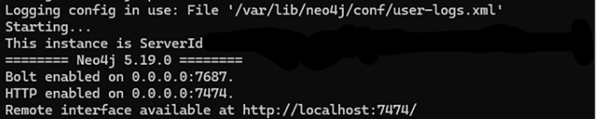
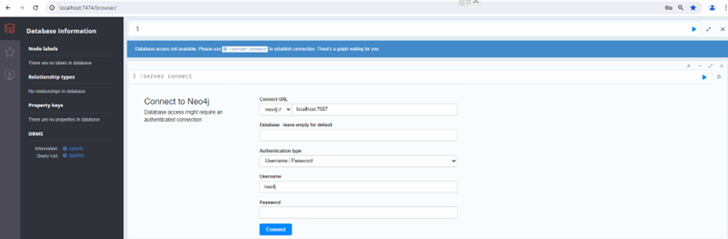
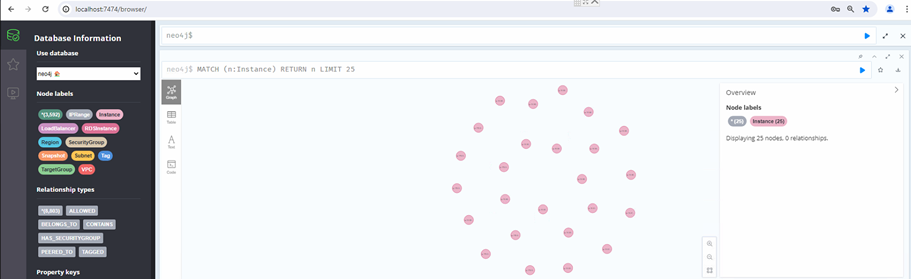

# Setup Ne04j Visualizer for AWS Environment 

## A. Prerequisites:

*	python 3
*	pip
*	neo4j==5.9.0
*	python-dotenv==1.0.0
*	pytz==2023.3
*	boto3
*	AWS CLI
*	Docker (for Neo4j, or Neo4j can be installed directly)
*	IAM user with SecurityAudit and ViewOnlyAccess policies.

## B. Installation:

### 1. Python3 and Pip:
Install Python 3 and pip:
```
apt install python3 python3-pip -y
```

### 2.	Dependencies:
Install required Python packages:
```
pip install neo4j python-dotenv==1.0.0 pytz==2023.3 boto3
```

### 3. AWS CLI:
Follow the instructions [here](https://docs.aws.amazon.com/cli/latest/userguide/getting-started-install.html) to install AWS CLI, then configure it:

```
aws configure
```

### 4. Docker:
Install Docker and Docker Compose:
```
apt install docker.io docker-compose -y
```

## C. Setup Neo4j Visualizer:

### 1. Start Docker:
Run the following Docker command or alternatively use the [docker-compose.yml](docker-compose.yml)
```
docker run -p 7474:7474 -p 7687:7687 -v $PWD/data:/data -v $PWD/plugins:/plugins --name neo4j-apoc -e NEO4J_apoc_export_file_enabled=true -e NEO4J_apoc_import_file_enabled=true  -e NEO4J_dbms_security_procedures_unrestricted=apoc.\\\* -e NEO4J_apoc_import_file_use__neo4j__config=true -d neo4j
```

### 2. Wait and Check Logs:
Wait until Docker is up, and tail the logs to ensure the interface is available.



### 3. Access Neo4j Visualizer:
Open your browser and navigate to: http://localhost:7474/
Login using the default credentials (username: neo4j, password: neo4j).

 

### 4. Update Password:
Follow the prompts to update the password. Note down the new password; it will be required later.

### 5. Run Boto3 Scripts:
CD into the boto3 folder and run the Boto3 scripts one by one. Each script will save the output as a JSON file.
```
python3 get_instance_1.py
python3 get_securitygroup_2.py
python3 get_rds_3.py
python3 get_vpc_4.py
python3 get_alb_5.py
```

### 6. Place Output:
Move the saved output files to the Neo4j folder.

### 7. Update Environment:
Rename and move ‘.env.sample’ to ‘.env’ in the Neo4j folder.
Update the neo4j DB password in the ‘.env’ file

### 8. Update Neo4j Database:
Update the Neo4j database with the findings from the AWS obtained by the Boto3 scripts.
```
python3 update_intelligence_db.py
```

## D. Explore Database:
Return to the browser and click on the "Database Information" tab in Neo4j.
Explore "Node Labels" and "Relationship Types" to delve into the details.


### This sequence ensures a smooth setup and utilization of the Neo4j database with AWS data obtained through Boto3 scripts.
